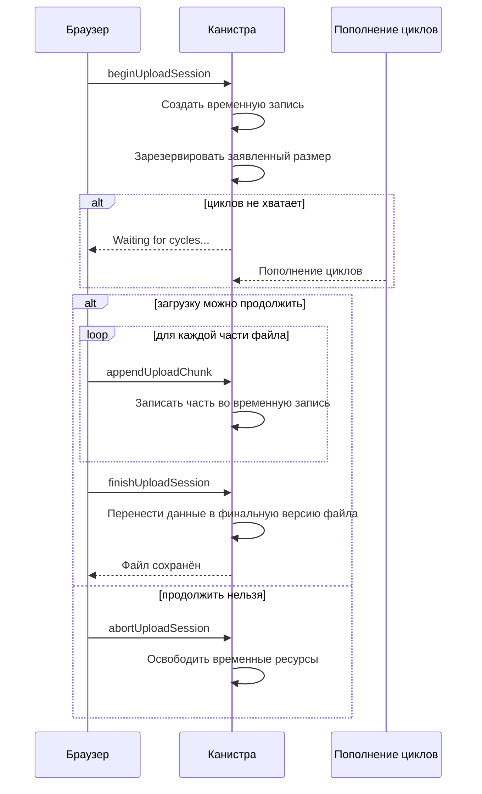

import { OverviewGroup, Steps } from '@rspress/core/theme';

## Что такое On-chain Storage

On-chain Storage хранит файл прямо внутри вашей персональной канистры.
Внешнего storage-сервиса для байтов нет: канистра хранит сам файл, запись о
нём и правила доступа.

Этот режим проще по модели доверия, но дороже. Каждый сохранённый байт живёт
в памяти канистры и оплачивается циклами, поэтому On-chain Storage лучше
подходит для небольших, ценных файлов.

:::tip{title="Компромисс"}

Вы убираете внешний слой хранения. В обмен стоимость выше, а баланс циклов
становится частью обычной работы с хранилищем.

:::

## Где находится файл

Путь On-chain Storage короче:

- браузер подготавливает и загружает файл прямо в канистру;
- персональная канистра хранит файл, доверенную запись и состояние доступа;
- внешнего gateway-сервиса и внешнего объектного хранилища в пути файла нет.

## Как работает загрузка

Перед загрузкой канистра проверяет, что файл можно безопасно принять: у вас
есть право записи, заявленный размер подходит для хранилища, а баланса циклов
достаточно для операции.

<Steps>

### Подготовить файл в браузере

Браузер шифрует файл локально и делит его на части, чтобы загрузка не
требовала одного большого запроса.

### Передать части в канистру

Канистра принимает части файла по одной и следит, что загрузка остаётся в
границах разрешённого размера и доступных циклов.

### Сохранить файл и доверенную запись

После передачи всех частей канистра сохраняет файл и фиксирует данные, которые
браузер использует для будущей проверки.

</Steps>

## Если циклов не хватает

В On-chain Storage баланс циклов быстро становится практическим ограничением:
файл хранится внутри канистры, и запись байтов тоже оплачивается циклами. Если
во время загрузки безопасного запаса не хватает, возможны два сценария.

- **Активный Pro включён**: Rabbithole может запросить автопополнение циклов.
  Интерфейс показывает **Waiting for cycles...**, а загрузка ждёт пополнения.
- **Активного Pro нет**: владелец должен пополнить канистру вручную. После
  пополнения совместимая повторная попытка может продолжить загрузку.

Это не ошибка владения и не потеря файла. Канистра просто не начинает работу,
которую не сможет безопасно завершить.

## Как работает скачивание

<Steps>

### Запросить части файла у канистры

Браузер запрашивает у канистры данные файла. Внешнего gateway-сервиса в пути
файла нет.

### Проверить и открыть локально

Браузер проверяет целостность и расшифровывает файл на вашем устройстве.

</Steps>

## Почему это дороже

On-chain Storage дороже, потому что каждый сохранённый байт живёт внутри памяти
канистры и влияет на её операционный баланс.

- Сеть поддерживает хранение байтов во времени.
- Stable memory и вычисления оплачиваются циклами канистры.
- Большие файлы требуют большего безопасного минимума циклов (safe floor) и
  могут чаще запускать проверки финансирования.

## Практические ограничения

On-chain Storage разумен, когда:

- файлы относительно небольшие;
- файлов немного;
- простота архитектуры важнее, чем экономия;
- вы готовы следить за балансом циклов или поддерживать активный Pro.

Для больших медиабиблиотек и дешёвого массового хранения этот режим обычно не
подходит.

## Почему модель доверия проще

При On-chain Storage нет внешнего файлового gateway-сервиса и внешнего
объектного хранилища, которые держат файл. Поэтому путь хранения проще:

- браузер подготавливает файл;
- канистра хранит файл;
- браузер проверяет его и открывает.

## Технические детали

:::details{title="Сессия загрузки"}

On-chain Storage не записывает большой файл сразу в финальное состояние.
Загрузка проходит через сессию: канистра сначала создаёт временную запись,
резервирует заявленный размер, принимает части файла и только затем переносит
данные в финальную версию файла.

Если циклов не хватает, сессия остаётся в ожидании пополнения. Совместимая
повторная попытка может продолжить существующую сессию, поэтому загрузка не
обязана начинаться с нуля. Если продолжить нельзя, клиент пытается завершить
сессию через отмену и освободить временные ресурсы.

:::

## Читать дальше

<OverviewGroup
  group={{
    name: 'Связанные страницы',
    items: [
      {
        text: 'Как работает Blob Storage',
        link: '/ru/how-it-works/storage/blob-storage',
      },
      {
        text: 'Как Rabbithole проверяет ваши файлы',
        link: '/ru/how-it-works/storage/integrity',
      },
      {
        text: 'Оплата и циклы',
        link: '/ru/how-it-works/payment',
      },
    ],
  }}
/>

<OverviewGroup
  group={{
    name: 'Официальные материалы',
    items: [
      {
        text: 'Canister smart contracts',
        link: 'https://docs.internetcomputer.org/building-apps/essentials/canisters',
      },
      {
        text: 'Canister storage and stable memory',
        link: 'https://internetcomputer.org/docs/building-apps/canister-management/storage',
      },
      {
        text: 'Motoko stable memory',
        link: 'https://internetcomputer.org/docs/motoko/base/ExperimentalStableMemory',
      },
    ],
  }}
/>
