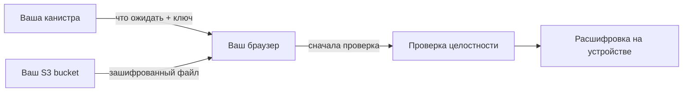

import { OverviewGroup, Steps } from '@rspress/core/theme';

## Что это

Rabbithole сам файлы не хранит. По умолчанию зашифрованные байты хранилища
[Blob Storage](/ru/how-it-works/storage/blob-storage) держит
[**Caffeine Blob Storage**](https://caffeine.ai/) — внешний сервис, который
хранит их в S3-совместимом хранилище и берёт на себя оплату этого места и
поддержание порядка в хранимых данных.

Собственное S3-хранилище заменяет этот сервис вашим **bucket** — контейнером, в
котором S3-провайдер держит объекты. Сама схема работы при этом не меняется —
меняются только две вещи:

- **Кто держит байты** — ваш bucket вместо Caffeine.
- **Кто платит за место** — вы платите провайдеру напрямую, а не ваша канистра
  платит Caffeine.

Всё остальное — как прежде. Файлы по-прежнему шифруются в браузере, а канистра
по-прежнему хранит записи о файлах, права доступа и подписывает ссылки, по
которым файл читают и записывают. В ваш bucket попадают только зашифрованные
данные, поэтому провайдер видит размеры объектов и время обращений, но ничего
читаемого.

## Зачем это нужно

- Держать зашифрованные файлы у провайдера, которого вы выбрали и которому
  доверяете, вместо стандартного сервиса.
- Самому выбирать регион и срок хранения и платить провайдеру по его цене.
- Отдать отслеживание и уборку удалённых файлов своей канистре, а не стороннему
  сервису.

Собственное S3-хранилище — это переключатель, который вы включаете для уже
созданного хранилища Blob Storage, а не отдельный режим при создании. Хранилища
on-chain держат байты внутри канистры и bucket не используют.

## Что понадобится и где это взять

**Bucket** — это просто контейнер, в котором облачный провайдер держит объекты.
Чтобы его подключить, нужен S3-совместимый bucket и ключ доступа, который может в
него читать и писать. Подойдёт любой из:

- **AWS S3**, **Cloudflare R2**, **Backblaze B2**, **Wasabi** — облачные
  провайдеры. Вы регистрируетесь, создаёте bucket и заводите ключ доступа.
- **MinIO** — S3-совместимое хранилище, которое вы разворачиваете сами, если
  хотите держать его у себя.

У провайдера нужно сделать три вещи: создать bucket, узнать его регион и адрес
S3 API (endpoint) и завести ключ доступа **только к этому bucket**, а не ко
всему аккаунту. Последнее важно: ключ хранится в вашей канистре, поэтому давайте
ему минимум прав.

Вот что означает каждое поле формы подключения и откуда его взять:

| Поле | Что это | Где найти |
|---|---|---|
| **Endpoint** | HTTPS-адрес S3 API вашего провайдера | В документации или настройках bucket — напр. `https://s3.us-east-1.amazonaws.com`, `https://<account>.r2.cloudflarestorage.com` |
| **Region** | Код региона bucket | Выбирается при создании bucket — напр. `us-east-1` (`auto` для R2) |
| **Bucket** | Имя bucket | То имя, которое вы ему дали |
| **Prefix** | Необязательный путь-«папка», под которым лежат все объекты | Выбираете сами — напр. `rabbithole/storage` |
| **Access key ID** + **Secret** | Ключ доступа, которым канистра подписывает ссылки | На странице ключей доступа / API-токенов провайдера |
| **Session token** | Только для временных ключей | Оставьте пустым для обычных долгоживущих ключей |
| **Force path-style** | Выбирает формат URL | Включён (по умолчанию) для MinIO и большинства S3-совместимых провайдеров; выключен для AWS S3 |

## Как подключить bucket

Подключение bucket входит в подписку Pro. После подключения повседневная работа —
загрузка, скачивание, доступ для других — идёт ровно как раньше.

<Steps>

### Откройте «Data storage»

В хранилище Blob Storage откройте страницу настроек **Data storage**.

### Введите данные bucket

Заполните поля выше: endpoint, регион, имя bucket, необязательный префикс и ключ
доступа с секретом. Сессионный токен и переключатель path-style нужны только тем
провайдерам, которые их требуют.

### Rabbithole проверяет доступ перед сохранением

Прежде чем что-то сохранить, Rabbithole записывает, читает и удаляет пробный
объект — так он убеждается, что ключ действительно работает. Если проверка не
прошла, не сохраняется ничего: ни запись о bucket, ни секрет.

</Steps>

:::note Секрет остаётся в канистре

Браузер никогда не получает ваш секрет от S3. Его хранит канистра и использует
только для того, чтобы подписывать короткоживущие ссылки на конкретные объекты.
Состояние канистры копируется по всей сети Internet Computer, поэтому считайте
это удобством, а не сейфом для паролей: давайте ключу доступ только к этому
bucket и префиксу — и ничего сверх этого.

:::

## Где хранится файл


Ваша канистра и ваш bucket делают разную работу. Канистра хранит запись о файле,
решает, у кого есть доступ, и подписывает ссылки, по которым файл читают и
записывают. В bucket на каждый файл лежат два зашифрованных объекта и больше
ничего:

```text
{prefix}/v1/blobs/{rootHash}/tree.json   как файл проверяется
{prefix}/v1/blobs/{rootHash}/blob.bin    сам зашифрованный файл
```

Имена объектов — это просто хэши под выбранным вами префиксом. В них нет ни имён
файлов, ни папок, ни адресов почты, поэтому провайдер видит только размеры
объектов и время обращений, но ничего читаемого.

## Как проходит загрузка

Загрузка идёт в несколько шагов.

<Steps>

### Подготовка

Браузер шифрует файл и спрашивает у канистры разрешение на загрузку. Канистра
проверяет, что вам можно писать, и выдаёт короткоживущие подписанные ссылки под
этот конкретный файл.

### Отправка в ваш bucket

Браузер загружает зашифрованный файл прямо в ваш bucket по этим ссылкам. Большие
файлы отправляются по частям.

### Подтверждение

Когда загрузка прошла, браузер просит канистру записать файл: его размер, хэш и
то, кому можно его открывать.

</Steps>

Загрузка, которая не дошла до подтверждения, файлом не становится, а оставшиеся
объекты убираются сами.

## Как проходит скачивание



Браузер читает зашифрованный файл из вашего bucket, но по-прежнему спрашивает у
канистры, что он должен получить и можно ли расшифровывать, и перед открытием
сверяет файл с этим ответом. Утёкшая ссылка раскроет только зашифрованные
байты — без разрешения канистры расшифровать их нельзя.

:::note Подписанные ссылки живут недолго

Каждая ссылка работает для одного объекта и одного действия и истекает за
минуты. Относитесь к ней как к ключу: тот, у кого она есть, может выполнить это
одно действие, пока она не истекла. Утёкшая ссылка на чтение покажет лишь
зашифрованные байты; утёкшая ссылка на запись в худшем случае испортит загрузку,
но не раскроет ваши файлы.

:::

## Как удаляются файлы

Удаление идёт в два этапа, а уборка проходит сама.

Когда вы удаляете файл, он сразу пропадает из приложения: канистра перестаёт его
показывать и перестаёт выдавать ключ для расшифровки.

Байты убираются из bucket потом, в фоне. В стандартном режиме это делает уборка
Caffeine; со своим bucket — ваша канистра: она отправляет запрос на удаление и,
прежде чем считать дело сделанным, убеждается, что объекта действительно больше
нет. Неудавшееся удаление канистра повторяет сама. Внимания стоит лишь один
случай — сломанный ключ доступа: тогда уборка встаёт на паузу, а страница
показывает предупреждение, пока вы не замените ключ.

## Сколько это стоит

За сами байты Rabbithole плату не берёт — за них вам выставляет счёт напрямую
ваш провайдер, по своей цене.

Вашей канистре по-прежнему нужны [циклы](/ru/how-it-works/payment) на её
собственную работу: подпись ссылок и небольшие запросы к вашему bucket на
удаление и проверку во время уборки. С подпиской Pro
[автопополнение](/ru/how-it-works/payment#как-работает-автопополнение-циклов)
может держать её профинансированной.

## Смена ключа или bucket

- **Заменить ключ доступа** — тот же endpoint, bucket и префикс. Создайте у
  провайдера новый ключ, сохраните его (Rabbithole заново проверит доступ) и
  отключите старый. Замена ключа у bucket, которым вы уже пользуетесь, не требует
  Pro.
- **Перейти на другой bucket** — новый endpoint, bucket или префикс считаются
  новым местом. С этого момента новые файлы идут туда. Уже сохранённые файлы
  продолжают ссылаться на то место, где их байты лежат на самом деле.

:::note Смена bucket не переносит старые файлы

Каждый файл помнит bucket, в который был записан. Подключение нового меняет то,
куда пойдут следующие загрузки, но не копирует туда уже сохранённые файлы.

:::

## Что остаётся прежним

Собственное S3-хранилище меняет то, где лежат зашифрованные байты и кому вы за
них платите. Владение и защита не меняются: файлы всё так же шифруются в
браузере, ещё до того как покинут ваше устройство, браузер всё так же проверяет
файл перед расшифровкой, а канистра всё так же хранит владение, права доступа и
доверенные записи о файлах. Starter Vault и Pro по-прежнему определяют, какие
зашифрованные загрузки разрешены.

:::note Доступность теперь зависит от вашего провайдера

Раз байты лежат в вашем bucket, их доступность — это дело между вами и
провайдером. Если вы перестанете платить провайдеру или потеряете доступ к
bucket, зашифрованные файлы могут стать недоступны. Запись о файле ваша канистра
хранит в любом случае.

:::

## Читать дальше

<OverviewGroup
  group={{
    name: 'Связанные страницы',
    items: [
      {
        text: 'Как работает Blob Storage',
        link: '/ru/how-it-works/storage/blob-storage',
      },
      {
        text: 'Как Rabbithole проверяет ваши файлы',
        link: '/ru/how-it-works/storage/integrity',
      },
      {
        text: 'Что даёт подписка Pro',
        link: '/ru/how-it-works/pro',
      },
      {
        text: 'Модель доверия',
        link: '/ru/how-it-works/trust-model',
      },
    ],
  }}
/>

<OverviewGroup
  group={{
    name: 'Официальные материалы',
    items: [
      {
        text: 'Canister smart contracts',
        link: 'https://docs.internetcomputer.org/building-apps/essentials/canisters',
      },
      {
        text: 'HTTPS outcalls',
        link: 'https://docs.internetcomputer.org/building-apps/network-features/using-http/https-outcalls/overview',
      },
      {
        text: 'Certified data',
        link: 'https://docs.internetcomputer.org/tutorials/developer-liftoff/level-3/3.3-certified-data',
      },
    ],
  }}
/>
