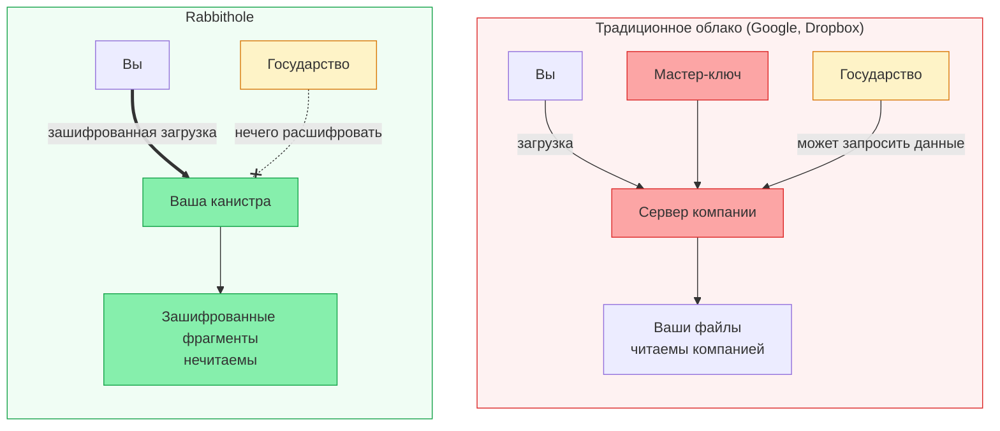

## Чему нужно доверять?

У любой системы хранения есть модель доверия. Эта страница показывает, что
Rabbithole убирает из пути доверия и чему всё ещё нужно доверять.

Содержимое файлов шифруется в браузере до отправки. Rabbithole, инфраструктура
хранения и операторы узлов не получают читаемый файл.

Приватность и доступность — разные свойства. Шифрование защищает содержимое
файла. Доступность зависит от режима хранения, баланса циклов и, для Blob
Storage, правил удержания (retention) внешнего слоя хранения.

Если поддержка TEE доступна на нужном IC-сабнете, она улучшает изоляцию среды
исполнения. Rabbithole рассматривает TEE как дополнительный слой защиты, а не
как основную гарантию приватности.

### Вам НЕ нужно доверять

- **Команде Rabbithole** — мы не видим содержимое файлов в открытом виде
- **Операторам узлов ICP** — они обрабатывают зашифрованные блобы
- **Сетевой инфраструктуре** — шифрование происходит до отправки в сеть

### Вам НУЖНО доверять

- **Коду шифрования** — он [открыт](https://github.com/rabbithole-app/v2), проверьте сами
- **Вашему браузеру** — шифрование работает в JavaScript-движке браузера
- **Internet Identity** — для аутентификации (тоже открытый код)
- **Консенсусу ICP** — что сеть корректно выполняет код канистр

## Модель угроз

Сначала разделим свойства. Шифрование защищает содержимое файла, контроль
доступа решает, кто может запросить файл и ключ, а проверка целостности помогает
обнаружить подмену байтов. В таблице ниже важно не одно слово «защищено», а
граница: как устроена защита и что остаётся отдельной ответственностью.

| Сценарий | Как устроена защита | Где граница |
|----------|----------------------|-------------|
| Команда Rabbithole получает доступ к файлам | Открытое содержимое не попадает к Rabbithole | Файл шифруется в браузере до загрузки |
| Атака «человек посередине» | Браузер проверяет подлинность ответа и канала | Используются сертифицированные ответы IC и HTTPS |
| Оператор узла ICP подглядывает | Узлы получают только зашифрованные данные | Данные уходят в IC уже после шифрования в браузере |
| Государство запрашивает данные у Rabbithole | У Rabbithole нет открытого содержимого файла | Метаданные и сервисные записи не являются содержимым файла |
| Вы потеряли устройство | Доступ можно восстановить через Internet Identity | Потерянное устройство всё равно нужно защищать системными средствами |
| Нежелательное обновление вашей канистры | Установка новой версии требует контроллера | Если контроллер у вас, проверяйте код перед обновлением |
| У канистры заканчиваются циклы | Приватность содержимого не меняется | Это проблема доступности: нужно ручное пополнение или активный Pro |
| Blob Storage перестаёт хранить байты | Канистра хранит доверенную запись о файле | Доступность байтов зависит от финансирования Blob Storage и срока удержания (retention) |

## Rabbithole vs Традиционное облако

## Сравнение с другими решениями

| Решение | Децентрализация | Требуемое доверие | Суверенитет данных |
|---------|:---:|:---:|:---:|
| Google Drive | — | Высокое | Нет |
| Dropbox | — | Высокое | Нет |
| Tresorit | — | Среднее | Частичный (E2E, но компания контролирует инфру) |
| IPFS + Encryption | Высокая | Среднее | Частичный (нет встроенного шифрования) |
| **Rabbithole** | **Высокая** | **Низкое** | **Полный (вы владеете канистрой)** |

:::note{title="Идеальных систем не существует"}

Rabbithole снижает требования к доверию, но ни одна система не устраняет их
полностью. Если вы найдёте уязвимость,
[сообщите](https://github.com/rabbithole-app/v2/issues).

:::
