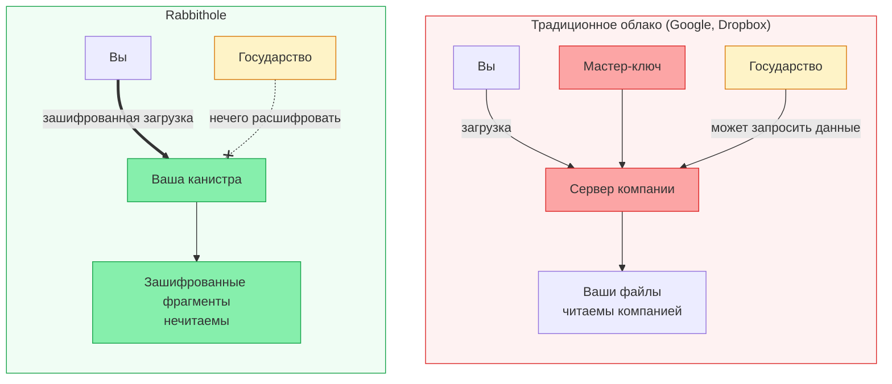

## Чему нужно доверять?

Любая система хранения требует определённого уровня доверия. Вот что именно требует Rabbithole — и что нет.

Самые сильные гарантии приватности действуют, когда шифрование включено.  
Без шифрования Rabbithole всё ещё применяет владение и правила доступа, но storage-инфраструктура может видеть содержимое файла.

Поддержка TEE в Internet Computer улучшает изоляцию среды исполнения, но её нужно рассматривать как дополнительный слой hardening, а не как основную privacy-гарантию Rabbithole.

### Вам НЕ нужно доверять

- **Команде Rabbithole** — мы не видим ваши данные в открытом виде, когда шифрование включено
- **Операторам узлов ICP** — они обрабатывают только зашифрованные блобы, когда шифрование включено
- **Сетевой инфраструктуре** — шифрование происходит до отправки в сеть, когда оно включено

### Вам НУЖНО доверять

- **Коду шифрования** — он [открыт](https://github.com/rabbithole-app/v2), проверьте сами
- **Вашему браузеру** — шифрование работает в JavaScript-движке браузера
- **Internet Identity** — для аутентификации (тоже открытый код)
- **Консенсусу ICP** — что сеть корректно выполняет код канистр

## Модель угроз

| Режим | Что защищено |
|-------|--------------|
| Зашифрованный | Контроль доступа + конфиденциальность содержимого + проверка целостности |
| Без шифрования | Контроль доступа + проверка целостности |

| Угроза | Защита? | Как |
|--------|---------|-----|
| Rabbithole читает ваши файлы | В зашифрованном режиме | Клиентское шифрование, zero-knowledge хранение |
| Хакер взламывает вашу канистру | В зашифрованном режиме | Хранятся только зашифрованные блобы |
| Атака «человек посередине» | Да | Сертифицированные ответы IC + HTTPS |
| Оператор узла ICP подглядывает | В зашифрованном режиме | Данные зашифрованы до отправки в IC |
| Государство запрашивает данные | В зашифрованном режиме | У Rabbithole нечего предоставить |
| Вы потеряли устройство | Частично | Восстановление через Internet Identity |
| Вредоносное обновление кода | Смягчено | Открытый код, обновление требует контроллера (вас) |

## Rabbithole vs Традиционное облако

## Сравнение с другими решениями

| Решение | Децентрализация | Требуемое доверие | Суверенитет данных |
|---------|:---:|:---:|:---:|
| Google Drive | — | Высокое | Нет |
| Dropbox | — | Высокое | Нет |
| Tresorit | — | Среднее | Частичный (E2E, но компания контролирует инфру) |
| IPFS + Encryption | Высокая | Среднее | Частичный (нет встроенного шифрования) |
| **Rabbithole** | **Высокая** | **Низкое** | **Полный (вы владеете канистрой)** |

:::note{title="Идеальных систем не существует"}

Rabbithole минимизирует требования к доверию, но ни одна система не может устранить их полностью. Мы верим в прозрачность: если вы найдёте уязвимость, [сообщите](https://github.com/rabbithole-app/v2/issues).

:::
