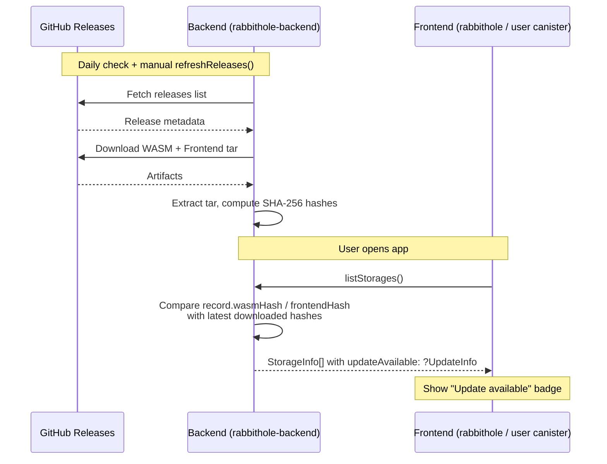
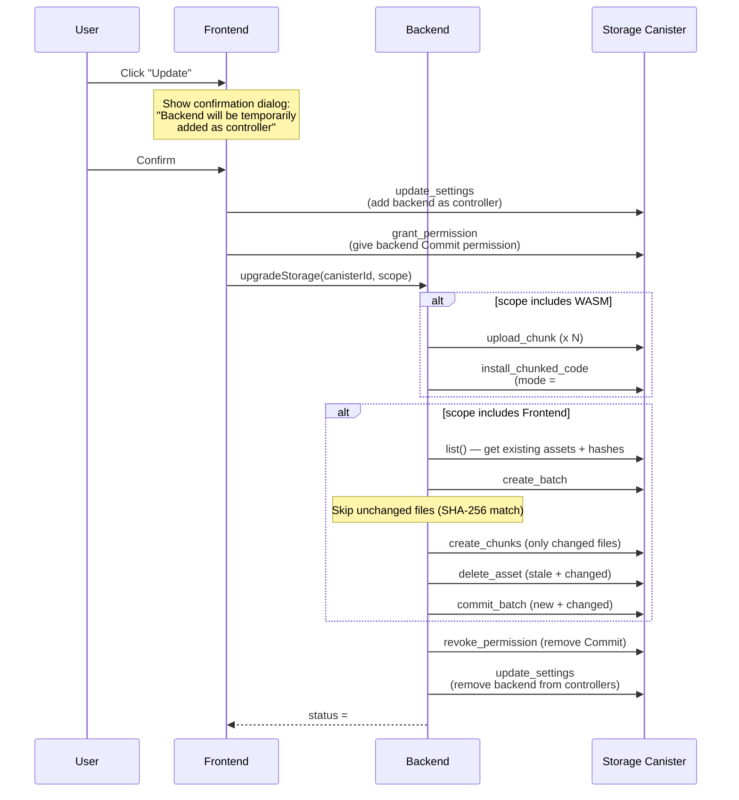
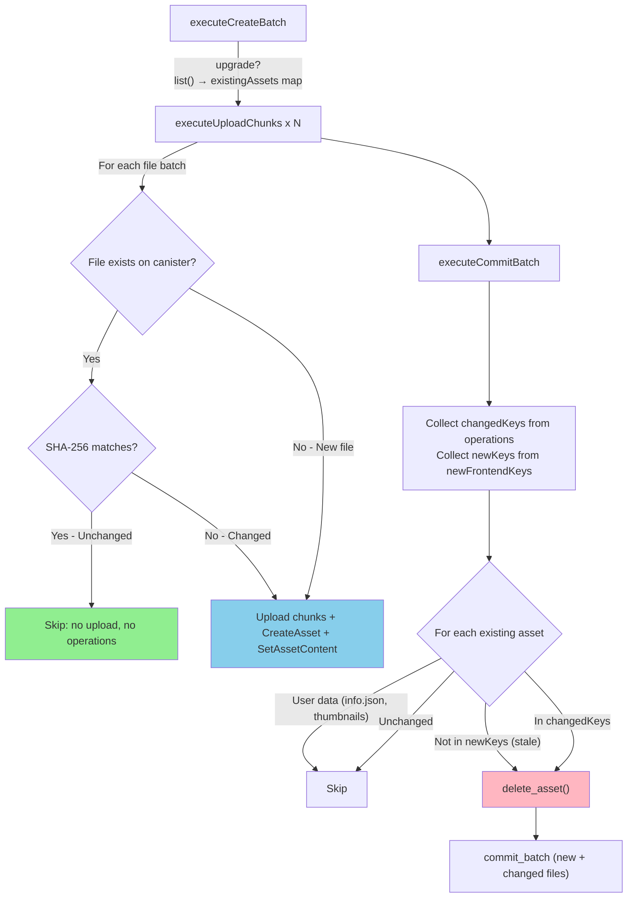

# Storage Upgrade Architecture

## Overview

Storage upgrade allows users to update their encrypted-storage canisters when a new version is released. The backend compares installed hashes with the latest downloaded release and surfaces update availability through the API.

### Key Concepts

- **WASM and frontend are independent artifacts** with separate hashes
- **Partial upgrades** supported: `#All`, `#WasmOnly`, `#FrontendOnly`
- **Diff-based frontend upload**: only changed files are uploaded, unchanged files are skipped based on SHA-256 comparison
- **Stale asset cleanup**: old frontend files not present in the new version are deleted

## Architecture

### Update Detection Flow



### Upgrade Flow



### Frontend Upgrade Detail — Diff-Based Upload



## API Reference

### Backend Endpoints (main.mo)

#### `upgradeStorage(canisterId, scope) -> Result<(), UpgradeStorageError>`

Starts an upgrade for a storage canister. Caller must be the owner.

```typescript
// scope options
{ All: null }          // WASM + Frontend
{ WasmOnly: null }     // Only WASM
{ FrontendOnly: null } // Only Frontend
```

**Errors:**
| Error | Description |
|-------|-------------|
| `#NotFound` | No storage record for this canisterId + caller |
| `#NotCompleted` | Storage is not in Completed status |
| `#AlreadyUpgrading` | Upgrade already in progress |
| `#NoUpdateAvailable` | No update available for requested scope |

**Prerequisites (done by frontend before calling):**
1. `update_settings` on storage canister — add backend as controller
2. `grant_permission({ to_principal: backendCanisterId, permission: #Commit })` — allow frontend asset commits

#### `checkStorageUpdate(canisterId) -> ?UpdateInfo`

Public query (no auth required). Returns update info for any canister created via StorageDeployer. Designed for use by user frontends deployed on storage canisters.

```typescript
type UpdateInfo = {
  currentWasmHash: [] | [Uint8Array];
  availableWasmHash: [] | [Uint8Array];
  currentReleaseTag: [] | [string];
  availableReleaseTag: [] | [string];
  wasmUpdateAvailable: boolean;
  frontendUpdateAvailable: boolean;
};
```

#### `listStorages() -> StorageInfo[]`

Returns all storages for the caller. Each `StorageInfo` includes `updateAvailable: [] | [UpdateInfo]`.

### Storage Canister Endpoint

#### `getModuleHash() -> ?Blob`

Returns the canister's actual WASM module hash via `canister_status`. Only callable by controllers. Allows the owner to verify the real WASM hash independently from backend data.

Added to both:
- `apps/encrypted-storage-mo/src/EncryptedStorageCanister.mo`
- `apps/backend/src/EncryptedStorageCanister.mo`

## Types

### New Types (Types.mo)

```motoko
public type UpdateInfo = {
  currentWasmHash : ?Blob;
  availableWasmHash : ?Blob;
  currentReleaseTag : ?Text;
  availableReleaseTag : ?Text;
  wasmUpdateAvailable : Bool;
  frontendUpdateAvailable : Bool;
};

public type UpgradeScope = {
  #All;
  #WasmOnly;
  #FrontendOnly;
};

public type UpgradeStorageError = {
  #NotFound;
  #NotOwner;
  #NotCompleted;
  #NoUpdateAvailable;
  #ReleaseNotReady;
  #AlreadyUpgrading;
};
```

### Extended Types

- `CreationStatus` — added `#UpgradingWasm`, `#UpgradingFrontend`
- `StorageCreationRecord` — added `installedReleaseTag : ?Text`
- `StorageInfo` — added `updateAvailable : ?UpdateInfo`
- `#WasmInstallChunked` / `#WasmInstallCode` — added `mode : CanisterInstallMode`

## Modified Files

| File | Changes |
|------|---------|
| `StorageDeployer/Types.mo` | New types: `UpdateInfo`, `UpgradeScope`, `UpgradeStorageError`; extended records |
| `StorageDeployer/WasmInstaller.mo` | Parameterized `mode`; refactored to `(store, args)` pattern |
| `StorageDeployer/FrontendInstaller.mo` | Diff-based upload (skip unchanged files); stale asset cleanup; Apple Double filter |
| `StorageDeployer/TarExtractor.mo` | Filter macOS Apple Double (`._*`) files from tar archives |
| `StorageDeployer/lib.mo` | `upgradeStorage`, `checkStorageUpdate`, `getUpdateInfo`, `finalizeCompletion`, `queuePostWasmTasks` |
| `main.mo` | New endpoints: `upgradeStorage`, `checkStorageUpdate` |
| `EncryptedStorageCanister.mo` (both) | `getModuleHash()` method |

## Known Limitations — http-assets Library

Two bugs/limitations in `http-assets@0.2.0` that affect frontend upgrades:

1. **`#DeleteAsset` inside `commit_batch` does NOT delete from main FS.** The `commit_batch` merge only calls `insert_asset` for assets in `tmp_fs`. `#DeleteAsset` removes from `tmp_fs`, so deleted assets are NOT in `tmp_fs` during merge and remain in the main filesystem.

2. **`#SetAssetContent` / `#CreateAsset` for existing files triggers Certs.mo assert.** During merge, `insert_asset` calls `remove_asset_certificates(fs, key, prev, true)` which asserts `asset.is_aliased == ?true`. This fails for any file with `is_aliased != ?true` (i.e., everything except `index.html`).

**Workaround:** Use direct `delete_asset()` calls before `commit_batch` for both stale and changed assets.

## Tests

### Test Checklist

Tests from `apps/backend/tests/storage-deployer.test.ts`.

| # | Test | Status | Description |
|---|------|--------|-------------|
| 1 | `should report no update available when assets haven't changed` | Done | Verifies no false positives after initial deployment |
| 2 | `should reject upgrade when no update available` | Done | Error: `#NoUpdateAvailable` |
| 3 | `should reject upgrade from non-owner` | Done | Error: `#NotFound` (different caller) |
| 4 | `should detect update available after assets change` | Done | Refresh with v2 frontend, verify `frontendUpdateAvailable == true` |
| 5 | `should allow checkStorageUpdate from any caller` | Done | Public query works without auth |
| 6 | `should upgrade storage frontend only` | Done | Full E2E: add controller, grant permission, upgrade `#FrontendOnly`, verify cleanup |
| 7 | `should return update info in listStorages` | Done | `updateAvailable` field present in `StorageInfo` response |
| 8 | `should upgrade storage with new WASM and frontend (full upgrade #All)` | TODO | E2E: both WASM and frontend hashes differ, upgrade with `#All` scope |
| 9 | `should upgrade storage WASM only (#WasmOnly)` | TODO | E2E: only WASM hash differs, upgrade with `#WasmOnly` scope |
| 10 | `should reject upgrade when storage is not completed (#NotCompleted)` | TODO | Start creation, immediately call `upgradeStorage` before completion |

### Notes on Missing Tests

- **#8 (Full upgrade)**: Requires `AssetProvider` to provide different WASM binary along with different frontend. After upgrade, both `wasmHash` and `frontendHash` should be updated in the record.
- **#9 (WASM only)**: Similar to #8 but only WASM changes. Frontend hash should remain unchanged.
- **#10 (Not completed)**: Needs a storage creation in progress (not yet `#Completed`). Call `upgradeStorage` immediately after `createStorage` — should return `#NotCompleted`.

## Frontend Integration (TODO)

### rabbithole-frontend

`listStorages()` already returns `updateAvailable : ?UpdateInfo` for each storage.

**Implementation plan:**
1. **Storage list card** — show "Update available" badge (WASM / Frontend / Both)
2. **Update dialog** — show what will be updated, scope selector (All/WasmOnly/FrontendOnly)
3. **Confirmation step** — explain that backend canister will be temporarily added as controller
4. **Pre-upgrade calls** (from frontend, on behalf of user):
   ```typescript
   // 1. Add backend as controller
   await ic.management.update_settings({
     canister_id: storageCanisterId,
     settings: { controllers: [userPrincipal, backendCanisterId] }
   });
   
   // 2. Grant Commit permission
   await storageActor.grant_permission({
     to_principal: backendCanisterId,
     permission: { Commit: null }
   });
   
   // 3. Start upgrade
   await backendActor.upgradeStorage(storageCanisterId, scope);
   ```
5. **Polling** — same as creation flow, poll `listStorages()` for status changes
6. **Completion** — backend auto-revokes permission and removes itself from controllers

### User frontend (on storage canister)

The storage canister's own frontend can check for updates:

```typescript
// backendCanisterId is known from environments
const updateInfo = await backendActor.checkStorageUpdate(ownCanisterId);
if (updateInfo.length > 0) {
  // Show notification about available update
  // User can navigate to rabbithole-frontend to perform the upgrade
}
```
